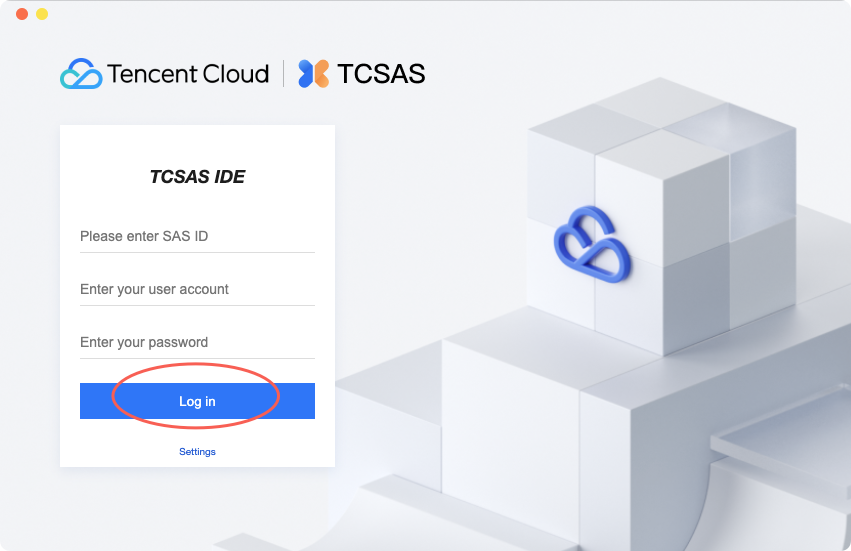
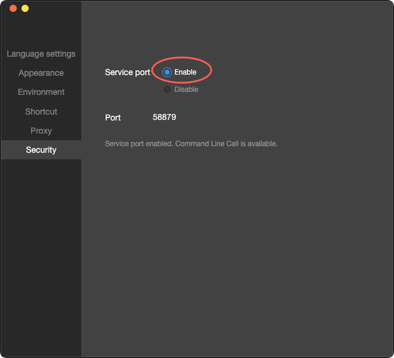

# TCSAS-Devtools MCP Server

[](https://opensource.org/licenses/MIT)

An MCP (Model Context Protocol) server designed to connect AI assistants with `TCSAS-Devtools` for a seamless miniprogram development experience.

This server wraps the basic functionalities of `TCSAS-Devtools` into a set of tools that can be called by AI assistants (like CodeBuddy, Cursor, Claude), allowing you to open, build, preview, and upload miniprograms using natural language.

## ✨ Features

-   **Launch IDE**: Directly open the `TCSAS-Devtools` application or a specific miniprogram project.
-   **Check Installation**: Verify if `TCSAS-Devtools` is installed on the local machine.
-   **Preview Miniprogram**: Generate a QR code for previewing the miniprogram on a mobile device.
-   **Upload Miniprogram**: Upload a new version of the miniprogram with specified version information.

## 🚀 Prerequisites

Before you begin, ensure you have the following software installed:

-   [Node.js](https://nodejs.org/) (v20 or higher recommended)
-   [npm](https://www.npmjs.com/)
-   [TCSAS-Devtools](https://www.tencentcloud.com/zh/products/tcsas)

## 📦 Installation and Setup

1.  **For first-time use, please download the installation package for TCSAS-Devtools from the console in advance.**
2.  **After installation, please open it to complete the login process and enable the service port.**


Settings - Security - Enable


**Ensure the above steps are completed. Then you can configure the MCP server in your Code Agent and start using it.**

## 🤖 How to Use in Cursor

You can integrate this server with any AI assistant that supports custom MCP servers. Here are the steps to configure it in Cursor:

1.  **Start the Server**: First, run the `tcsas-mcp` server on your local machine following the steps above.

2.  **Open Cursor Settings**: In Cursor, find the settings for AI integration. This is usually located in `Settings` > `Extensions` > `Claude` or a similar configuration area for managing AI providers.

3.  **Add Custom MCP Service**: Look for an option like "Add Model Context Provider" or "MCP Server" and click "Add".

4.  **Enter Command**: For example:

    `"tcsas-devtools-mcp-server": {
      "command": "npx",
      "args": [
        "-y",
        "tcsas-devtools-mcp-server@latest"
      ]
    }```json

    **Illustration**: (A screenshot of the Cursor settings panel could be placed here, showing the user entering the command in the "Command" field)

    

5.  **Connect and Start Using**: After adding, Cursor will connect to your local server. Now you can interact with it in the chat. For example, you can type:

    > "Launch TCSAS-Devtools and open my project at `/Users/me/projects/my-miniprogram`."

    > "Generate a preview QR code for the project I'm currently developing."

## 🛠️ Tool API Reference

Below is a detailed description of all the tools provided by this MCP server:

#### `launchIde`
Launches the `TCSAS-Devtools` IDE.
-   **Input Parameters:**
    -   `path` (optional, string): The absolute path to the miniprogram project to open.


#### `checkIdeInstalled`
Checks if the `TCSAS-Devtools` IDE is installed.
-   **Input Parameters:** None

#### `previewMiniprogram`
Generates a preview QR code for a miniprogram project.
-   **Input Parameters:**
    -   `path` (string): The absolute path to the miniprogram project.

#### `uploadMiniprogram`
Uploads a new version of the miniprogram.
-   **Input Parameters:**
    -   `path` (string): The absolute path to the project.
    -   `version` (string): The new version number (e.g., "1.0.1").
    -   `describeMessage` (string): A short description of the changes.

Contributions are welcome! Please feel free to submit a Pull Request.

## 📜 License

This project is open-sourced under the [MIT License](LICENSE).
